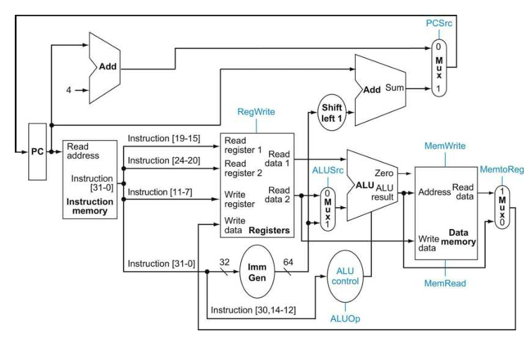
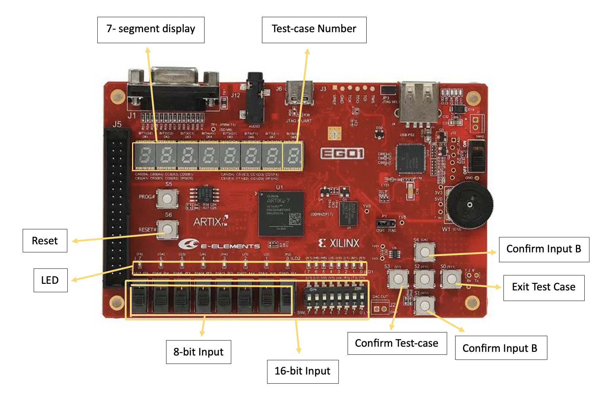

<div align=center>

# RISC-V CPU

Single-Cycle Processor for RISC-V ISA Built in Verilog

SUSTech 2024 Spring's Project of Course `CS202 - Computer Organization` Led By Professor [Jin ZHANG](https://jinzhang-sustech.github.io/)

<div align="center">
    
</div>

</div>

[*[Read the detailed project requirements]*](./project_info/CS202-ComputerOrgnization-Spring2024-ProjectRequirments.pdf)

[*[Read the detailed project report]*](./project_info/REPORT.pdf)

## Project Directory
```
RISC-V CPU
├── assembly_test-risc_v
│   ├── scenario1.asm                                  # assembly code for testing scenario 1
│   ├── scenario1_hex.coe                              # assembly code for testing scenario 1 in hex
│   ├── scenario2.asm                                  # assembly code for testing scenario 2
│   └── scenario2_hex.coe                              # assembly code for testing scenario 2 in hex                              
├── cpu-verilog
│   └── Final_CPU
│       ├── Final_CPU.cache
│       ├── Final_CPU.hw
│       ├── Final_CPU.ip_user_files
│       ├── Final_CPU.runs
│       ├── Final_CPU.sim
│       ├── Final_CPU.srcs
│       │   ├── constrs_1
│       │   │   └── new
│       │   │       └── const.xdc                      # constraint file
│       │   ├── sim_1
│       │   └── sources_1
│       │       ├── ip
│       │       │   ├── RAM
│       │       │   │   ├── dmem32word.coe             # word-addressable data mem
│       │       │   ├── cpu_clk
│       │       │   │   ├── cpu_clk.v
│       │       │   └── prgrom
│       │       │       ├── scenario1.coe              # inst mem for testing scenario 1
│       │       │       ├── scenario2.coe              # inst mem for testing scenario 2
│       │       └── new                                # cpu implementation code
│       │           ├── ALU.v
│       │           ├── CPU.v
│       │           ├── Clock.v
│       │           ├── Controller.v
│       │           ├── DataMem.v
│       │           ├── Decoder.v
│       │           ├── IFetch.v
│       │           ├── IOReader.v
│       │           ├── Led.v
│       │           ├── MemOrIO.v
│       │           ├── Switch.v
│       │           ├── Tube.v
│       │           └── clock_divider.v
│       ├── Final_CPU.xpr                              # main vivado project file
├── project_info
└── README.md
```
*Note*: This is a simplified project directory tree. The detailed directory tree can be found [here](./project_info/directory-tree.txt).

## CPU Architecture Design
### Basic CPU Info
- `Clock Frequency` 23Mhz
- `CPI` 1
- `Structure` Havard Architecture
- `Addressing Unit`
  - `Registers` Support 32 bits for data read and write
  - `I/O` Support 8 bits or 16 bits for data read, and 8 bits or 32 bits for data write
- `Size of Instruction Space and Data Space` 64 KB (2^14 * 4 bytes)
- `Base Address of Stack Space` 0x7fffeffc
- `Registers Info` 32 registers with each has a bit width of 32 bits

### CPU Datapath
<div align="center">
    
</div>

### Supported RISC-V Instructions
#### R-type
| Instruction | Encoding              | Usage Method                |
|-------------|-----------------------|-----------------------------|
| `ADD`         | 7'b0110011 + funct3:000 + funct7:0000000 | `add rd, rs1, rs2`          |
| `SUB`         | 7'b0110011 + funct3:000 + funct7:0100000 | `sub rd, rs1, rs2`          |
| `AND`         | 7'b0110011 + funct3:111 + funct7:0000000 | `and rd, rs1, rs2`          |
| `OR`          | 7'b0110011 + funct3:110 + funct7:0000000 | `or rd, rs1, rs2`           |
| `SLL`         | 7'b0110011 + funct3:001 + funct7:0000000 | `sll rd, rs1, rs2`          |
| `SRA`         | 7'b0110011 + funct3:101 + funct7:0100000 | `sra rd, rs1, rs2`          |

#### I-type
| Instruction | Encoding              | Usage Method                |
|-------------|-----------------------|-----------------------------|
| `ADDI`        | 7'b0010011 + funct3:000 | `addi rd, rs1, imm`         |
| `ANDI`        | 7'b0010011 + funct3:111 | `andi rd, rs1, imm`         |
| `ORI`         | 7'b0010011 + funct3:110 | `ori rd, rs1, imm`          |
| `XORI`        | 7'b0010011 + funct3:100 | `xori rd, rs1, imm`         |
| `SRLI`        | 7'b0010011 + funct3:101 + funct7:0000000 | `srli rd, rs1, imm`         |
| `LW`          | 7'b0000011 + funct3:010 | `lw rd, offset(rs1)`        |
| `LB`          | 7'b0000011 + funct3:000 | `lb rd, offset(rs1)`        |
| `LBU`         | 7'b0000011 + funct3:100 | `lbu rd, offset(rs1)`       |

#### S-type
| Instruction | Encoding              | Usage Method                |
|-------------|-----------------------|-----------------------------|
| `SW`          | 7'b0100011 + funct3:010 | `sw rs2, offset(rs1)`       |

#### B-type
| Instruction | Encoding              | Usage Method                |
|-------------|-----------------------|-----------------------------|
| `BEQ`        | 7'b1100011 + funct3:000 | `beq rs1, rs2, offset`      |
| `BNE`         | 7'b1100011 + funct3:001 | `bne rs1, rs2, offset`      |
| `BLT`         | 7'b1100011 + funct3:100 | `blt rs1, rs2, offset`      |
| `BGE`         | 7'b1100011 + funct3:101 | `bge rs1, rs2, offset`      |
| `BLTU`        | 7'b1100011 + funct3:110 | `bltu rs1, rs2, offset`     |
| `BGEU`        | 7'b1100011 + funct3:111 | `bgeu rs1, rs2, offset`     |

#### J-type
| Instruction | Encoding              | Usage Method                |
|-------------|-----------------------|-----------------------------|
| `JAL`         | 7'b1101111            | `jal rd, offset`            |

#### U-type
| Instruction | Encoding              | Usage Method                |
|-------------|-----------------------|-----------------------------|
| `LUI`         | 7'b0110111            | `lui rd, imm`               |

## FPGA I/O
### I/O Support
- Board: Xilinx Artix-7 FPGA development board, EGO1 (XC7A35T-1CSG324C)
- Use lw/lb/lbu with negative address to get input
- Use sw with negative address to display output
- Address to I/O mapping:
  - `0xfffffc00` 16 switches
  - `0xfffffc10` left 8 switches
  - `0xfffffc20` button V1
  - `0xfffffc22` button R11
  - `0xfffffc24` button R17
  - `0xfffffc26` button U4
  - `0xfffffc40` 16 LED
  - `0xfffffc60` right 8 LED
  - `0xfffffc69` tube 32-bit
  - `0xfffffc70` tube 16-bit

### Control Diagram
<div align="center">
    
</div>

*Note*: The top button where it says `Confirm Input B` in the control diagram should be changed to `Confirm Input A`.

## CPU Testing
To check if the CPU can execute RISC-V instructions correctly, detailed testing schemes are provided [here](./project_info/CPU-Project-Testing.pdf).

### Scenario 1: Basic

| Test Case Number | Test Case Description | Passed |
|------------------|-----------------------|:------:|
| `3'b000`         | Input test number `a`, input test number `b`, and display the `8-bit` binary format of `a` and `b` on the output device (LED) | :heavy_check_mark: |
| `3'b001`         |  Input test number `a`, place it in a register by instruction `lb`, display the value of the `32-bit` register in hexadecimal format on the output device (7 segment tubes or VGA), and save the number to memory (in the `3'b011`-`3'b111` test case, the value of `a` will be read from the memory unit using the lw instruction for comparison) | :heavy_check_mark: |
| `3'b010`         | Input test number `b`, place it in a register by instruction lbu, display the value of the `32-bit` register in hexadecimal format on the output device (7 segment tubes or VGA), and save the number to memory (in the `3'b011`-`3'b111` test case, the value of `b` will be read from the memory unit using the lw instruction for comparison) | :heavy_check_mark: |
| `3'b011`         | Compare test number `a` and test number `b` (from test case `3’b001` and test case `3’b010`) using instruction `beq`. If the relationship is true, light up the LED, but if the relationship is not true, turn off the LED | :heavy_check_mark: |
| `3'b100`         |  Compare test number `a` and test number `b` (from test case `3’b001` and test case `3’b010`) using instruction `blt`. If the relationship is true, light up the LED, but if the relationship is not true, turn off the LED | :heavy_check_mark: |
| `3'b101`         | Compare test number `a` and test number `b` (from test case `3’b001` and test case `3’b010`) using instruction `bge`. If the relationship is true, light up the LED, but if the relationship is not true, turn off the LED | :heavy_check_mark: |
|`3'b110`          |  Compare test number `a` and test number `b` (from test case `3’b001` and test case `3’b010`) using instruction `bltu`. If the relationship is true, light up the LED, but if the relationship is not true, turn off the LED | :heavy_check_mark: |
| `3'b111`         |  Compare test number `a` and test number `b` (from test case `3’b001` and test case `3’b010`) using instruction `bgeu`. If the relationship is true, light up the LED, but if the relationship is not true, turn off the LED | :heavy_check_mark: |

### Scenario 2: Relatively Complex

| Test Case Number | Test Case Description | Passed |
|------------------|-----------------------|:------:|
| `3'b000`         | Input an `8-bit` number, calculate and output the number of leading zeros (the number of leading zeros of `8’b00010000` is `3`) | :heavy_check_mark: |
| `3'b001`         | Input a `16-bit` IEEE754 encoded half word floating-point number, `round it up`, and output the rounded result | :heavy_check_mark: |
| `3'b010`         |  Input a `16-bit` IEEE754 encoded half word floating-point number, `round it down`, and output the rounded result | :heavy_check_mark: |
| `3'b011`         | Input a `16-bit` IEEE754 encoded half word floating-point number, `round it`, and output the rounded result | :heavy_check_mark: |
| `3'b100`         | Input numbers `a` and `b` (each of them is `8-bit`) , perform addition operations on `a` and `b`. If the sum exceeds `8 bits`, remove the high bits and add them up to the sum, then invert the sum, output the result | :heavy_check_mark: |
| `3'b101`         | Input `12-bit` or `16-bit` data in little endian mode from the dial switch and present it on the output device in big endian mode | :heavy_check_mark: |
|`3'b110`          |  Calculate the `n-th` number of `Fibonacci` sequence in a recursive manner, record the number of times the stack is pushed and popped, and display the sum of the pushed and popped times on the output device | :heavy_check_mark: |
| `3'b111`         | Calculate the `n-th` number of `Fibonacci` sequence in a recursive manner, record the pushed and popped data, display the pushed data on the output device, each pushed data display for 2-3 seconds (note that here we do not focus on the pushed and popped of the value of `ra` register, hence should output the Fibonacci sequence itself)| :heavy_check_mark: |

## Getting Started
### Setup
- Clone this GitHub repository or download the source code in ZIP then unzip `Final_CPU` folder at `./cpu-verilog/Final_CPU`
- Have `Vivado` ready, locate and open `.xpr` file at `./cpu-verilog/Final_CPU/Final_CPU.xpr`
- Generate bitstream
- Get the correct FPGA ready, open target, and program the board

### Control Manual
- After programming the board with the `.coe` file of either scenario 1 or 2, all the 16 LED should be lit up to indicate the initial state of the program
- Press button `S0` to turn off the LED
- Dial the top 8 switches to select a test case
- Confirm the the test case with button `S3`
- Give the test case an input with either 8 or 16 switches (depend on the test case), confirm the first input with button `S4`, and confirm the second input with button `S1` if there is one
- Then the CPU shall execute the instructions and output the results either to the LED or 7-segment tube
- Press button `S0` to exit the the test case before choosing another one

## Contribution
| Contributor | CPU Design & Implementation | Assembly Code (RISC-V) | Report |
| --- |:---:|:---:|:---:|
| [Jaouhara ZERHOUNI KHAL](https://github.com/Jouwy) | :heavy_check_mark: | :heavy_check_mark: | :heavy_check_mark: |
| [Layheng HOK](https://github.com/Layheng-Hok) | :heavy_check_mark: | :heavy_check_mark: | :heavy_check_mark: |
| [Harrold TOK Kwan Hang](https://github.com/Barracudapi) | :heavy_check_mark: | :heavy_check_mark: | :heavy_check_mark:|
