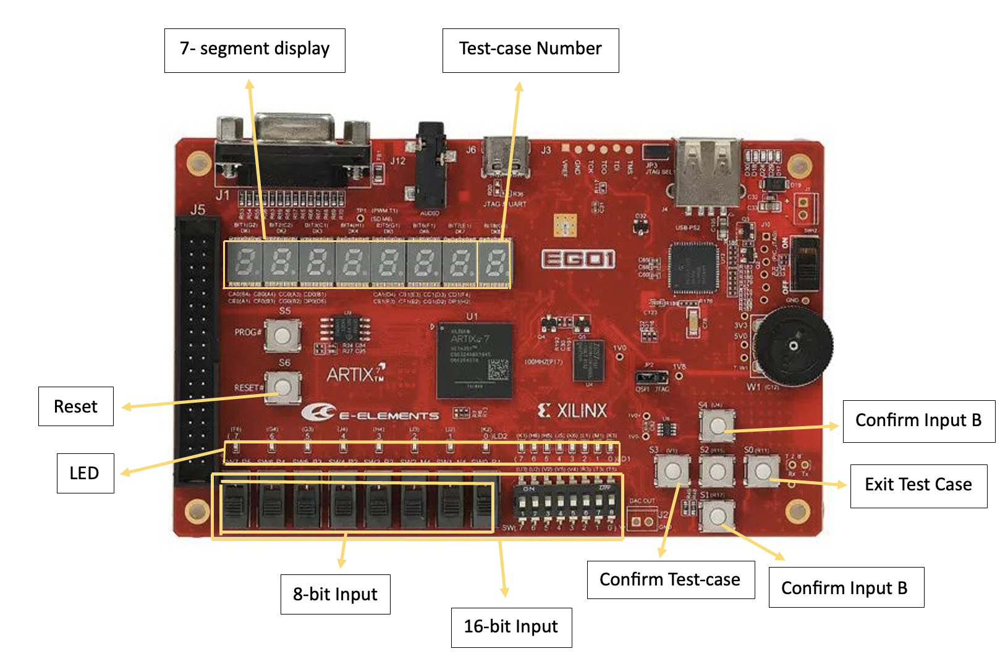

# Computer Organizaton CS202-2024s - CPU Project Report

> **Contributors**:   
> - Jaouhara ZERHOUNI KHAL (12211456)
> - Layheng HOK (12210736)
> - Harrold TOK Kwan Hang (12212025)  

## TABLE OF CONTENTS
[**I. Contribution**](#i-contribution)  
[**II. CPU Architecture Design Description**](#ii-cpu-architecture-design-description)  
[**III. Usage Instructions about the System**](#iii-usage-instructions-about-the-system)  
[**IV. Self Testing Instructions**](#iv-self-testing-instructions)    
[**V. Problem and Summary**](#v-problem-and-summary)


## I. Contribution
| Members                    | Tasks                                                                                                                                                                                                                                                                                                                                                                                                                      | Ratio |
| -------------------------- | -------------------------------------------------------------------------------------------------------------------------------------------------------------------------------------------------------------------------------------------------------------------------------------------------------------------------------------------------------------------------------------------------------------------------- | ----- |
| **Jaouhara ZERHOUNI KHAL** | - CPU Design<br>- Assembly code<br> &nbsp;&nbsp;&nbsp;&nbsp; - Basic Test Scenario 1 <br> &nbsp;&nbsp;&nbsp;&nbsp; - Basic Test Scenario 2 (3'b000 & 3'b1000)<br>- Documentation| 1/3   |  
| **Layheng HOK**     | - CPU Design<br>- Assembly code<br> &nbsp;&nbsp;&nbsp;&nbsp; - Basic Test Scenario 2 (3'b001, 3'b010, 3'b011 & 3'b101) | 1/3   |  
| **Harrold TOK Kwan Hang**    | - CPU Design<br>- Assembly code<br>&nbsp;&nbsp;&nbsp;&nbsp; - Basic Test Scenario 2 (3'b110 & 3'b111) <br> - Documentation| 1/3 |

---

## II. CPU Architecture Design Description

### CPU Features
  | Bits      | 31-25        | 24-20 | 19-15 | 14-12  | 11-7        | 6-0    |
|-----------|--------------|-------|-------|--------|-------------|--------|
| **R-type**| funct7       | rs2   | rs1   | funct3 | rd          | opcode |
| **I-type**| imm[11:0]    | -     | rs1   | funct3 | rd          | opcode |
| **S-type**| imm[11:5]    | rs2   | rs1   | funct3 | imm[4:0]    | opcode |
| **B-type**| imm[12] |imm[10:5] | rs2   | rs1   | funct3 | imm[4:1]imm[11] | opcode |
| **U-type**| imm[31:12]   | -     | -     | -      | rd          | opcode |
| **J-type**| imm[20|10:1|11|19:12] |rd | opcode |


#### R-type Instructions
| Instruction | Encoding              | Usage Method                |
|-------------|-----------------------|-----------------------------|
| ADD         | 7'b0110011 + funct3:000 + funct7:0000000 | `add rd, rs1, rs2`          |
| SUB         | 7'b0110011 + funct3:000 + funct7:0100000 | `sub rd, rs1, rs2`          |
| AND         | 7'b0110011 + funct3:111 + funct7:0000000 | `and rd, rs1, rs2`          |
| OR          | 7'b0110011 + funct3:110 + funct7:0000000 | `or rd, rs1, rs2`           |
| SLL         | 7'b0110011 + funct3:001 + funct7:0000000 | `sll rd, rs1, rs2`          |
| SRA         | 7'b0110011 + funct3:101 + funct7:0100000 | `sra rd, rs1, rs2`          |

#### I-type Instructions
| Instruction | Encoding              | Usage Method                |
|-------------|-----------------------|-----------------------------|
| ADDI        | 7'b0010011 + funct3:000 | `addi rd, rs1, imm`         |
| ANDI        | 7'b0010011 + funct3:111 | `andi rd, rs1, imm`         |
| ORI         | 7'b0010011 + funct3:110 | `ori rd, rs1, imm`          |
| XORI        | 7'b0010011 + funct3:100 | `xori rd, rs1, imm`         |
| SRLI        | 7'b0010011 + funct3:101 + funct7:0000000 | `srli rd, rs1, imm`         |
| LW          | 7'b0000011 + funct3:010 | `lw rd, offset(rs1)`        |
| LB          | 7'b0000011 + funct3:000 | `lb rd, offset(rs1)`        |
| LBU         | 7'b0000011 + funct3:100 | `lbu rd, offset(rs1)`       |

#### S-type Instructions
| Instruction | Encoding              | Usage Method                |
|-------------|-----------------------|-----------------------------|
| SW          | 7'b0100011 + funct3:010 | `sw rs2, offset(rs1)`       |

#### B-type Instructions
| Instruction | Encoding              | Usage Method                |
|-------------|-----------------------|-----------------------------|
| BEQ         | 7'b1100011 + funct3:000 | `beq rs1, rs2, offset`      |
| BNE         | 7'b1100011 + funct3:001 | `bne rs1, rs2, offset`      |
| BLT         | 7'b1100011 + funct3:100 | `blt rs1, rs2, offset`      |
| BGE         | 7'b1100011 + funct3:101 | `bge rs1, rs2, offset`      |
| BLTU        | 7'b1100011 + funct3:110 | `bltu rs1, rs2, offset`     |
| BGEU        | 7'b1100011 + funct3:111 | `bgeu rs1, rs2, offset`     |

#### J-type Instructions
| Instruction | Encoding              | Usage Method                |
|-------------|-----------------------|-----------------------------|
| JAL         | 7'b1101111            | `jal rd, offset`            |

#### U-type Instructions
| Instruction | Encoding              | Usage Method                |
|-------------|-----------------------|-----------------------------|
| LUI         | 7'b0110111            | `lui rd, imm`               |

### Reference ISA
The instructions listed above are based on the RISC-V Instruction Set Architecture (ISA).

### Updates or Optimizations
- Enhanced the control logic to support additional branch conditions (e.g., `blt`, `bge`, `bltu`, `bgeu`).
- Improved memory and I/O handling by distinguishing between memory access and I/O access using the high bits of the ALU result.
- Added support for I/O read and write instructions with specific encoding to handle unsigned and signed data correctly.
- Incorporated additional ALU operations such as `sll`, `sra`, `slli`and `srli` to support shift operations.

- **Registers**: 
  - Bit width: 32 bits
  - Number: 32 Registers

- **Support for Exception Handling**: 

### CPU Clock

### Clock Frequency and CPI

- **CPU Clock Frequency**: The clock frequency of the CPU is 23 MHz. This means the CPU's clock ticks 23 million times per second.
- **CPI (Cycles Per Instruction)**: The CPI is 1, since we use 1 cycle per instruction. This is because our CPU is a single-cycle CPU, meaning each instruction is completed in one clock cycle.

### CPU Type  

- **Single-cycle or Multi-cycle CPU**: This CPU is a single-cycle CPU. Each instruction completes in a single clock cycle, which simplifies the design but can limit performance at higher clock frequencies.
- **Pipeline Support**: This CPU does not support pipelining.

### Addressing Space Design

- **Structure**:
  - Harvard structure: The CPU uses the Harvard architecture. This structure is characterized by having separate memory spaces for instructions and data, which allows simultaneous access to both memories. This can improve performance by allowing the CPU to fetch instructions and read/write data at the same time.

- **Addressing Unit**: 
  - Data Read and Write Bits: 32 bits (4 bytes)

- **Size of Instruction Space and Data Space**: 64 KB (2^14 * 4 bytes)


- **Base Address of Stack Space**: 

### Support for I/O Device
- **Use separate instructions to access the I/O device (and corresponding instructions) or MMIO (and corresponding addresses of related I/O)**: 
- **Use polling or interrupt methods to access I/O**: 

### CPU Interface
- **clk**: 
- **reset**: 
- **uart interface**: 
- **Description about other normal I/O interface**: 

### CPU Internal Structure

### Interface Connection Diagram of Internal Submodules of CPU

### Design Description of CPU Internal Submodules
- **Port Specifications and Function Description of Submodules**: 

## III. Usage Instructions about the System

### Hardware Interface Description

#### Buttons and Switches:
- **Reset Button**
  - **Description**: Connected to pin `P15` on the FPGA, used to reset the CPU.
- **Confirm Test-case Button**
  - **Address**: `0xfffffc20`
  - **Description**: Connected to pin `V1` on the FPGA, used to confirm the test-case number.
- **Confirm Input A Button**
  - **Address**: `0xfffffc24`
  - **Description**: Connected to pin `R17` on the FPGA, used to confirm input A.
- **Confirm Input B Button**
  - **Address**: `0xfffffc26`
  - **Description**: Connected to pin `U4` on the FPGA, used to confirm input B.
- **Exit test-case Button**
  - **Address**: `0xfffffc22`
  - **Description**: Connected to pin `R11` on the FPGA, used to confirm the end of the test-case (turn off both tube and LED).
- **16-bit Switches**
  - **Address**: `0xfffffc00`
  - **Description**: Connected to pin from `T5` to pin `P5` on the FPGA, used to for test cases that require 16-bit input and 12-bit input. 
- **8-bit Switches**
  - **Address**: `0xfffffc10`
  - **Description**: Connected to pin from `R1` to pin `P5` on the FPGA, used to for test cases that require 8-bit input. 

#### LED and Tube:
- **LED**
  - **Address**: `0xfffffc40`
  - **Description**: Connected to pin from `K3` to pin `F6` on the FPGA, initially turned on indicating the start of the program. Turned off when button `Exit Test_case` is pressed.
- **Tube (7-segment)**
  - **Address**: `0xfffffc70`
  - **Description**: Used to display the output of the corresponding test cases. The right box indicating the test_case number (0-7).

### FPGA Board with the corresponding mapping



### Verilog Code Example:
```verilog
module cpu_interface (
    input wire clk,
    input wire rst_n,
    input wire button1,  // Reset button
    input wire button2,  // Start button
    input wire switch1,  // Mode selection switch
    output reg [1:0] leds // Status LEDs
);

// Button handling logic
always @(posedge clk or negedge rst_n) begin
    if (!rst_n)
        leds <= 2'b00; // Reset LEDs
    else if (button1)
        leds[0] <= 1'b1; // Turn on LED1
    else if (button2)
        leds[1] <= 1'b1; // Turn on LED2
end

endmodule
```


## IV. Self Testing Instructions

### Basic Test Scenario 1

| Testing Method | Testing Type    | Testcase Description                                                                 | Test Result (Pass/Fail) |
|----------------|-----------------|--------------------------------------------------------------------------------------|-------------------------|
| Simulation     | Unit Testing    | Verify the reset functionality by simulating a reset signal and checking if all registers are cleared. | Pass                     |
| Simulation     | Unit Testing    | Test the loading of immediate values into registers using the `li` instruction and verify the register values. | Pass                     |
| Simulation     | Unit Testing    | Simulate arithmetic operations (addition, subtraction) using `add` and `sub` instructions and verify the results. | Pass                     |
| On Board       | Integration Test | Test the branch instructions (`beq`, `bne`, `blt`, `bge`, `bltu`, `bgeu`) by setting up conditions where the branch should be taken and not taken, and observe LED indicators. | Pass                     |
| On Board       | Integration Test | Verify memory read and write operations by writing data to memory and then reading it back, checking if the read data matches the written data. | Pass                     |
| On Board       | Integration Test | Verify the correct execution of a simple program that performs a series of arithmetic operations and outputs the results to LED/tube display. | Pass                     |


### Basic Test Scenario 1

| Testing Method | Testing Type       | Testcase Number | Testcase Description                                                                                           | Test Results |
|----------------|--------------------|-----------------|---------------------------------------------------------------------------------------------------------------|--------------|
| Simulation     | Unit Testing       | 3'b000          | Run simulation to ensure the input data is saved correctly to the register and being passed to the LED     | Pass         |
| Simulation     | Unit Testing       | 3'b001          | Input test number `a`, store it in a register using `lb`, display the 32-bit register value in hex, and save it to memory. | Pass         |
| Simulation     | Unit Testing       | 3'b010          | Input test number `b`, store it in a register using `lbu`, display the 32-bit register value in hex, and save it to memory. | Pass         |
| On-board       | Integration Testing| 3'b011          | Compare test number `a` and test number `b` using instruction `beq`. If true, light up the LED; if not, turn off the LED. | Pass         |
| On-board       | Integration Testing| 3'b100          | Compare test number `a` and test number `b` using instruction `blt`. If true, light up the LED; if not, turn off the LED. | Pass         |
| On-board       | Integration Testing| 3'b101          | Compare test number `a` and test number `b` using instruction `bge`. If true, light up the LED; if not, turn off the LED. | Pass         |
| On-board       | Integration Testing| 3'b110          | Compare test number `a` and test number `b` using instruction `bltu`. If true, light up the LED; if not, turn off the LED. | Pass         |
| On-board       | Integration Testing| 3'b111          | Compare test number `a` and test number `b` using instruction `bgeu`. If true, light up the LED; if not, turn off the LED. | Pass         |

### Final Test Conclusion

The final testing of the CPU design using Verilog and RISC-V assembly language was conducted using both simulation and on-board methods. Unit testing in simulation and integration testing on the actual FPGA board were both successful. All test cases passed, indicating that the CPU design functions correctly in both isolated and integrated environments.


### Basic Test Scenario 2

| Testing Method | Testing Type    | Testcase Description                                                                 | Test Result (Pass/Fail) |
|----------------|-----------------|--------------------------------------------------------------------------------------|-------------------------|
| Simulation     | Unit Testing    | Verify input handling and output of leading zeros calculation for an 8-bit number.              | Pass                     |
| Simulation     | Unit Testing    | Test rounding up a 16-bit IEEE754 encoded floating-point number and verify the output. | Pass                     |
| Simulation     | Unit Testing    | Test rounding down a 16-bit IEEE754 encoded floating-point number and verify the output. | Pass                     |
| Simulation     | Unit Testing    | Test rounding a 16-bit IEEE754 encoded floating-point number and verify the output. | Pass                     |
| On Board       | Integration Test | Verify addition operations on two 8-bit numbers with overflow handling and result inversion. | Pass                     |
| On Board       | Integration Test | Test input of 12-bit data in little-endian mode from a switch and output in big-endian mode. | Pass                     |
| On Board       | Integration Test | Test calculation of Fibonacci numbers less than a given input in a recursive manner, tracking stack operations and displaying the result. | Pass                     |
| On Board       | Integration Test | Test calculation of Fibonacci numbers less than a given input in a recursive manner, displaying stack push and pop operations. | Pass                     |

### Final Test Conclusion
All testcases in Basic Test Scenario 2 were executed successfully. The system passed all the self-testing phases, both in simulation and on-board testing. The CPU design functions as expected, meeting all specified requirements and ensuring correct behavior for each testcase.


### Final Test Conclusion
All testcases were executed successfully, and the system passed all the self-testing phases, both in simulation and on-board testing. The CPU design functions as expected, meeting all specified requirements and ensuring correct behavior for each testcase.


## V. Problem and Summary
### Problems Encountered During Development

In this project, we built a single-cycle CPU based on the RISC-V ISA. Our goal was to create a working CPU that could run a set of instructions correctly. However, we faced several problems during development:

- **Understanding CPU Design**: Learning the details of CPU design was quite challenging and needed a deep understanding of both the hardware and the RISC-V instruction set.
- **Running RISC-V Codes on the FPGA**: It wasn't evident how to run the RISC-V codes on the FPGA. This included figuring out the correct procedure to load and execute the RISC-V programs on the hardware.
- **Verilog Integration**: Connecting the RISC-V code with the FPGA using Verilog was complex. We needed to make sure that all parts worked together correctly.
- **Debugging**: Debugging complex issues in both the Verilog code and the RISC-V assembly programs required meticulous attention to detail and often involved extended problem-solving efforts.
- **Meeting Deadlines**: Strict deadlines added pressure, necessitating efficient time management and prioritization of tasks to ensure timely completion of project milestones.

### Reflections and Summary

Despite these challenges, the project provided valuable learning experiences and opportunities for growth:

- **Enhanced Technical Skills**: We gained a deeper understanding of CPU architecture and the RISC-V ISA, improving our proficiency in both Verilog and hardware design.
- **Problem-Solving Abilities**: Overcoming the various obstacles enhanced our problem-solving abilities, teaching us to approach issues methodically and persistently.
- **Collaboration and Teamwork**: The project underscored the importance of effective collaboration and communication within a team, reinforcing the need for clear roles and consistent updates.
- **Project Management**: Managing the project's scope, timeline, and resources taught us valuable lessons in project management, particularly in balancing technical work with administrative responsibilities.

In summary, while the development process was filled with challenges, it was ultimately rewarding. We successfully implemented a single-cycle CPU capable of executing a set of RISC-V instructions. The experience has equipped us with critical skills and knowledge that will be invaluable in future projects.